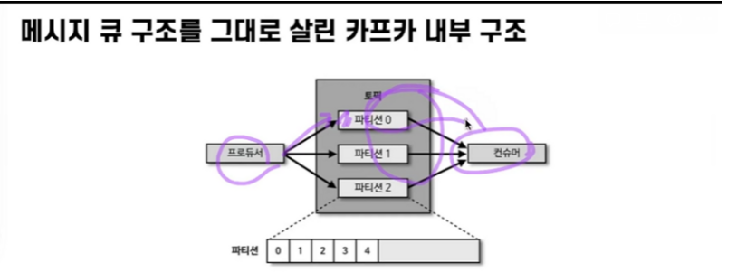
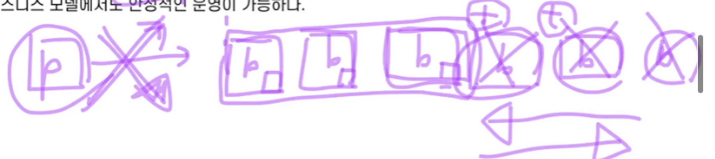
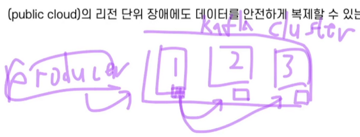
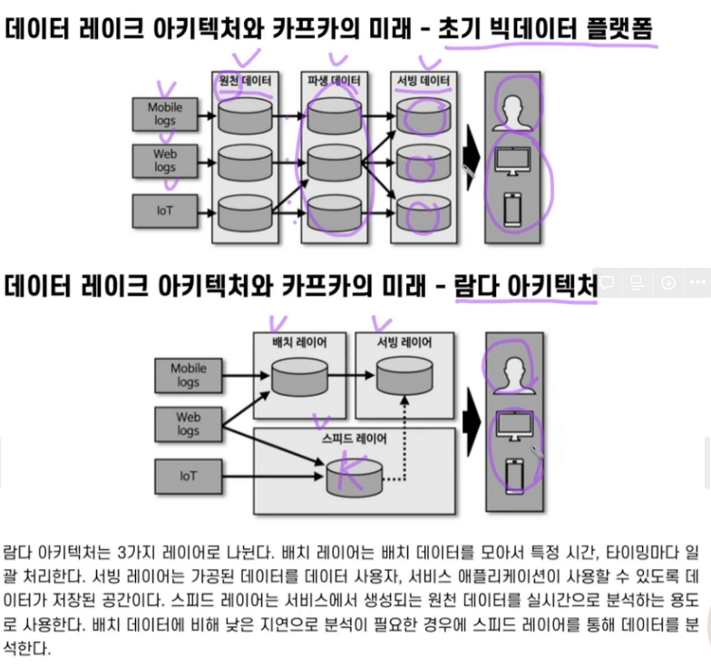
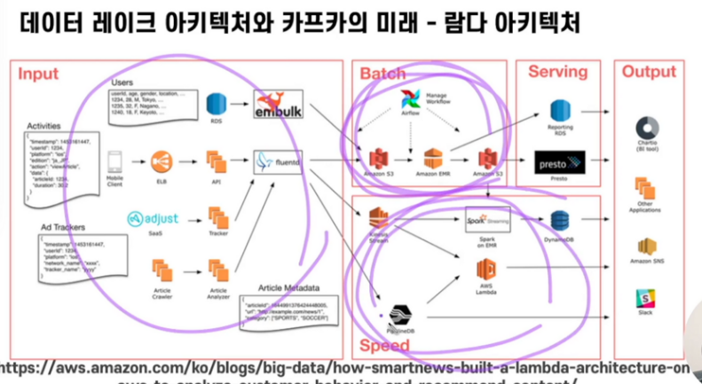
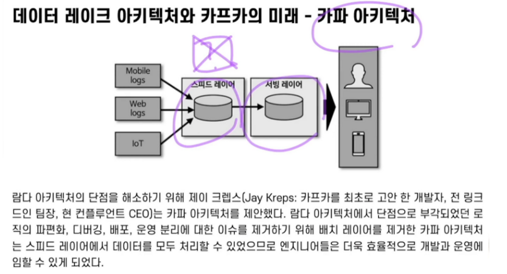
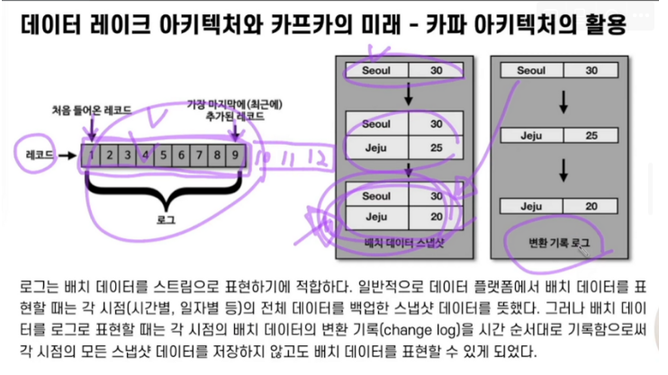
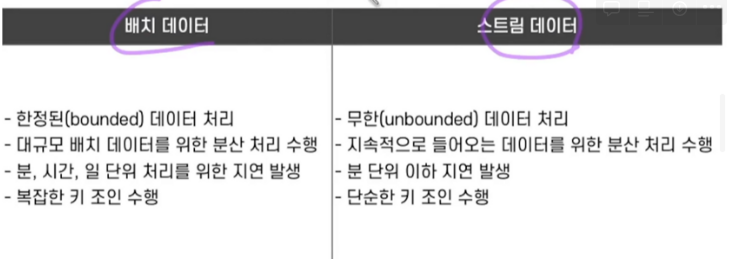
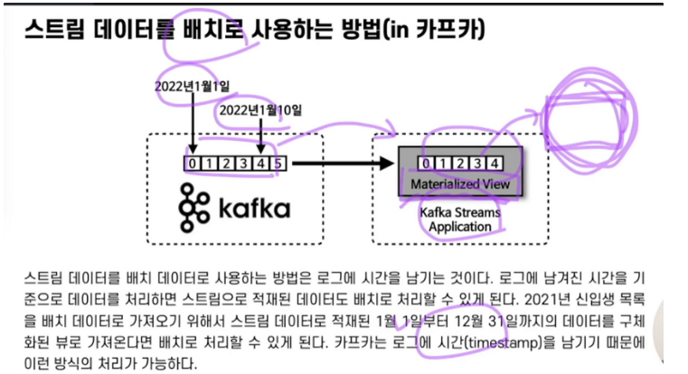

# 카프카 학습 정리 

- 프로듀서는 메세지를 토픽의 파티션에 적재
- 토픽의 파티션에 데이터가 적재되고, 컨슈머가 그것을 사용함
- 사용된 데이터는 사라지지 않는다

### 빅데이터 파이프라인에 카프카가 적절한 이유

1. 높은 처리량
    1. 데이터 양이 많을 때 네트워크를 태우는 횟수를 줄일 수 있음
        1. 프로듀서에서 배치 형태로 모아서 보냄
    2. 컨슈머를 늘림으로써 처리량을 병렬로 늘릴 수 있음
        1. 파티션 수 ≥ 컨슈머수
2.  확장성
    1. 데이터가 적을 때는 브로커 갯수를 적게 운영하고, 데이터가 많을때는 브로커 갯수를 늘린다. (`스케일 아웃`)
        
        
        
        - 1브로커 = 1컴퓨터
        - 무중단 운영 가능
3. 영속성
    1. 시스템이 종료되더라도 데이터가 사라지지 않음 (fs에 저장하고 사용)
        1. 운영체제에서 file IO 성능 향상을 위해 `page cache 영역`을 메모리에 따로 생성하여 사용. 한번 읽은 내용은 메모리에 저장시켰다가 다시 사용하는 방식
            - page cache
                
                페이지 캐시는 파일에서 최근에 액세스한 데이터를 저장하는 운영 체제 메모리 관리 시스템의 일부입니다. 하드 드라이브에서 파일을 읽으면 운영 체제는 데이터를 메모리에 로드하고 일정 시간 동안 페이지 캐시에 보관합니다.
                
                페이지 캐시는 고정 크기의 메모리 청크인 페이지로 나뉩니다. 각 페이지는 하드 드라이브에서 읽은 파일의 일부를 저장할 수 있습니다. 파일을 읽으면 데이터가 이러한 페이지로 분할되어 페이지 캐시에 저장됩니다. 파일에 다시 액세스하면 운영 체제는 느린 하드 드라이브에서 데이터를 읽을 필요 없이 페이지 캐시에서 데이터를 빠르게 검색할 수 있습니다.
                
                페이지 캐시는 운영 체제에서 관리하며 컴퓨터에서 실행되는 응용 프로그램에 투명합니다. 애플리케이션은 페이지 캐시에 대해 알거나 어떤 식으로든 관리할 필요가 없습니다. 대신 운영 체제에서 페이지 캐시를 관리하고 자주 액세스하는 데이터가 빠른 액세스를 위해 메모리에 보관되도록 합니다.
                
                페이지 캐시의 크기는 구성 가능하며 시스템 관리자가 조정할 수 있습니다. 더 큰 페이지 캐시는 메모리에 더 많은 데이터를 유지하여 성능을 향상시킬 수 있지만 컴퓨터에서 더 많은 메모리 리소스를 사용할 수도 있습니다.
                
                요약하면 페이지 캐시는 빠른 액세스를 위해 파일에서 최근에 액세스한 데이터를 메모리에 저장하는 운영 체제 메모리 관리 시스템의 일부입니다. 애플리케이션에 투명하고 운영 체제에서 관리합니다.
                
            - kafka page cache 활용
                
                Kafka는 디스크에서 데이터를 읽고 쓸 때 페이지 캐시를 사용하여 고성능과 낮은 대기 시간을 달성합니다.
                
                Kafka는 페이지 캐시를 사용하여 디스크에 기록되는 메시지를 버퍼링하고 디스크에서 읽은 메시지를 캐시합니다. 생산자가 Kafka에 메시지를 쓰면 메시지는 먼저 메모리에 버퍼링된 다음 디스크에 기록됩니다. Kafka는 페이지 캐시를 사용하여 이러한 메시지가 디스크에 기록되기 전에 메모리에 버퍼링하므로 쓰기 성능이 크게 향상될 수 있습니다.
                
                마찬가지로 소비자가 Kafka에서 메시지를 읽을 때 메시지는 먼저 디스크에서 읽은 다음 페이지 캐시를 사용하여 메모리에 캐시됩니다. 이를 통해 Kafka는 디스크에서 다시 읽을 필요 없이 메모리에서 읽을 수 있으므로 동일한 메시지에 대한 후속 요청을 신속하게 처리할 수 있습니다.
                
                전반적으로 Kafka의 페이지 캐시 사용은 분산 스트리밍 플랫폼에서 고성능을 달성하는 데 필수적인 메시지 읽기 및 쓰기에 필요한 시간을 최소화하는 데 도움이 됩니다.
                
            - 데이터가 디스크에 wirte되기 전 buffer에 있는 동안에 서버가 죽으면 데이터의 손실이 있는것 아닌가요?
                
                예, 데이터가 아직 버퍼에 있고 디스크에 기록되지 않은 상태에서 서버가 죽으면 데이터 손실 위험이 있습니다. 메모리에만 저장되는 데이터는 휘발성이며 서버가 충돌하거나 전원이 꺼지면 손실될 수 있기 때문입니다.
                
                이러한 시나리오에서 데이터 손실 위험을 최소화하기 위해 Kafka는 다음과 같은 여러 메커니즘을 사용합니다.
                
                1. 복제: Kafka는 내결함성을 제공하기 위해 클러스터의 여러 브로커 간에 데이터를 복제합니다. 즉, 한 브로커가 실패하더라도 다른 복제본에서 데이터를 검색할 수 있습니다.
                2. 쓰기 내구성: Kafka는 미리 쓰기 로그(WAL)를 사용하여 데이터가 기록된 것으로 확인되기 전에 데이터가 디스크에 기록되도록 합니다. 이는 데이터가 완전히 커밋된 것으로 간주되기 전에 디스크에 기록되므로 내구성을 보장합니다.
                3. 구성 가능한 매개변수: Kafka는 관리자가 성능과 내결함성 요구 사항의 균형을 맞추기 위해 복제 팩터 및 쓰기 내구성과 같은 매개변수를 구성할 수 있도록 합니다.
                
                이러한 메커니즘에도 불구하고 데이터가 디스크에 완전히 커밋되기 전에 서버가 실패하면 여전히 데이터 손실 위험이 있습니다. 이러한 위험을 최소화하려면 주기적인 데이터 백업 또는 별도의 시스템에 대한 실시간 데이터 복제와 같은 백업 및 복구 전략을 마련하는 것이 좋습니다.
                
            - write-ahead log (WAL)에 대해 쉽게 설명해줄래요?
                
                미리 쓰기 로그(WAL)는 데이터가 기록된 것으로 확인되기 전에 데이터가 디스크에 기록되도록 하기 위해 데이터베이스 및 스토리지 시스템에서 사용되는 기술입니다.
                
                최종 사본을 작성하기 전에 공책에 메모하는 것과 같다고 생각하십시오. 메모를 할 때 최종 사본에 영향을 주지 않고 실수하고, 줄을 긋고, 마음을 바꿀 수 있습니다. 메모에 만족하면 깨끗하고 정확한 최종 사본을 작성할 수 있습니다.
                
                마찬가지로 WAL은 데이터 변경 사항을 디스크에 기록하기 전에 기록하는 것과 같습니다. 데이터가 WAL에 기록되면 먼저 디스크에 저장된 로그 파일에 기록됩니다. 이는 시스템 장애 또는 충돌 시 복구에 사용할 수 있는 데이터 변경 기록을 제공합니다. 데이터가 WAL에 기록되면 기본 데이터베이스 또는 스토리지 시스템에 기록될 수 있습니다.
                
                이렇게 하면 WAL이 장애나 충돌이 발생한 경우 손실되거나 불완전한 데이터를 복구하는 데 사용할 수 있는 데이터 변경 기록을 제공하므로 데이터가 내구성 있고 내결함성 있는 방식으로 디스크에 기록됩니다.
                
                전반적으로 WAL은 데이터 변경 사항이 기본 데이터베이스나 스토리지 시스템에 기록되기 전에 로그 파일에 기록하여 데이터 변경 사항에 대한 내구성 보장을 제공하는 데 사용되는 기술입니다.
                
            - WAL을 쓰면 kafka가 disk io를 줄이기 위해 사용하는 page cache를 쓰는 의미가 없어지는거 아닌가요? 어짜피 WAL을 통해 disk io가 발생하잖아요?
                
                WAL(Write-Ahead Log)은 디스크에 쓰기를 포함하지만 Kafka에서 WAL을 사용한다고 해서 디스크 I/O를 줄이기 위해 페이지 캐시를 사용하는 이점이 무효화되지는 않습니다.
                
                Kafka에서 메시지가 생성되면 자주 액세스하는 데이터용으로 예약된 메모리의 일부인 페이지 캐시에 먼저 기록됩니다. 이를 통해 Kafka는 디스크에 쓰기 전에 메시지를 메모리에 빠르게 버퍼링하여 디스크에 자주 쓸 필요성을 줄입니다.
                
                그러나 메시지가 기록된 것으로 확인되기 전에 디스크의 별도 로그 파일인 WAL에도 기록됩니다. WAL은 데이터가 기록된 것으로 확인되기 전에 데이터가 디스크에 기록되도록 하여 내구성을 보장합니다. 이는 데이터가 디스크의 기본 데이터 파일에 기록되기 전에 서버가 충돌하거나 전원이 꺼지는 경우 백업을 제공합니다.
                
                따라서 WAL이 디스크에 쓰는 것과 관련이 있지만 Kafka에서 WAL을 사용한다고 해서 디스크 I/O를 줄이기 위해 페이지 캐시를 사용하는 이점이 무효화되지는 않습니다. 페이지 캐시는 여전히 메시지를 메모리에 버퍼링하여 디스크 I/O 작업의 빈도를 줄이는 데 도움이 되므로 전체 성능을 개선하고 대기 시간을 줄일 수 있습니다. WAL은 데이터가 기록된 것으로 확인되기 전에 데이터가 디스크에 기록되도록 보장함으로써 데이터 손실에 대한 추가 보호 계층을 제공함으로써 내구성을 보장합니다.
                
            - WAL은 메세지 전체를 기록하는게 아닌가요?
                
                Kafka의 미리 쓰기 로그(WAL)는 전체 메시지를 기록하지 않습니다. 대신 메시지 오프셋 및 메시지가 속한 파티션과 같은 메시지에 대한 메타데이터를 기록합니다.
                
                Kafka에서 메시지가 생성되면 자주 액세스하는 데이터용으로 예약된 메모리의 일부인 페이지 캐시에 먼저 기록됩니다. 그런 다음 메시지에 대한 메타데이터는 디스크의 별도 로그 파일인 WAL에 기록됩니다. 이 메타데이터에는 메시지 오프셋, 파티션 ID 및 타임스탬프와 같은 정보가 포함됩니다.
                
                이 메타데이터를 WAL에 기록함으로써 Kafka는 메타데이터가 기록된 것으로 확인되기 전에 디스크에 기록되도록 하여 내구성을 보장합니다. 이는 메타데이터가 디스크의 기본 데이터 파일에 기록되기 전에 서버가 충돌하거나 전원이 꺼지는 경우 백업을 제공합니다.
                
                실제 메시지 데이터는 순차적 쓰기에 최적화되어 있고 많은 양의 데이터를 효율적으로 처리할 수 있는 디스크의 기본 데이터 파일에 기록됩니다.
                
                따라서 Kafka의 WAL은 전체 메시지를 기록하지 않습니다. 대신 메시지에 대한 메타데이터를 기록하므로 메타데이터가 기록된 것으로 확인되기 전에 디스크에 기록되도록 하여 내구성을 보장합니다.
                
    
4. 고가용성
    1. 일부 서버에 장애가 발생하더라도 무중단으로 안전하고 지속적으로 데이터를 처리할 수 있음
        
        
        
        - 여러 브로커에 복제되어 저장됨
    2. 

### 데이터 아키텍처와 카프카

- 스피드 레이어에 카프카가 존재

- 람다 아키텍처는 레이어가 두개라서 데이터 융합의 유연성이 떨어지고, 로직도 두벌로 필요한 한계가 있음

- 배치와 스피드 레이어의 데이터를 모두 스피드 레이어에서 일괄적으로 처리
- 카프카를 통해 달성할 수 있음
    - 카프카가 배치 데이터와 스트림 데이터를 모두 모을 수 있음
        
        
        
        - 각 레코드 하나하나당 타임스탬프가 찍힘
        
        
        
        배치데이터 스냅샷을 통해 스트림 데이터를 배치 데이터로  만들 수 있음. 이때 변환 기록 로그에는 타임스탬프가 찍혀있어야 시간 순 기록이 가능함
        
        
        
        - 서빙 레이어에 RDB를 써도 되나요?
            
            사용 사례의 특정 요구 사항에 따라 관계형 데이터베이스(RDB)를 Kappa 아키텍처의 서빙 레이어로 사용할 수 있습니다.
            
            관계형 데이터베이스는 유연성, 확장성 및 강력한 쿼리 기능으로 인해 레이어를 제공하는 데 널리 사용됩니다. MySQL 및 PostgreSQL과 같은 많은 최신 관계형 데이터베이스는 높은 수준의 읽기 및 쓰기 트래픽을 처리하고 클러스터링 및 복제를 통해 내결함성을 제공할 수 있습니다.
            
            그러나 RDB를 Kappa 아키텍처의 서빙 레이어로 사용하는 데는 몇 가지 장단점이 있습니다. 관계형 데이터베이스는 정형 데이터를 처리하도록 설계되었으며 스트림 처리 사용 사례에서 더 일반적일 수 있는 비정형 또는 반정형 데이터를 처리하는 데 적합하지 않을 수 있습니다. 또한 관계형 데이터베이스는 NoSQL 데이터베이스와 같은 다른 데이터베이스 유형보다 수평 확장이 더 어려울 수 있습니다.
            
            요약하면 Kappa 아키텍처에서 관계형 데이터베이스를 서비스 계층으로 사용할 수 있지만 특정 데이터베이스 선택은 사용 사례의 요구 사항에 따라 달라집니다. RDB는 강력한 쿼리 기능과 확장성을 제공하지만 구조화되지 않은 데이터를 처리하거나 다른 유형의 데이터베이스만큼 수평적으로 확장하는 데 적합하지 않을 수 있습니다.