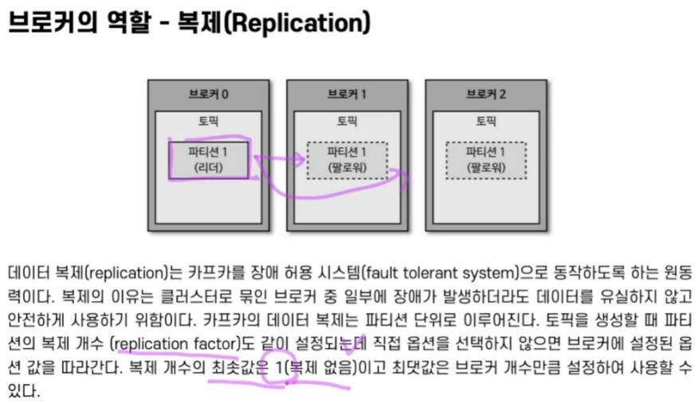

# 브로커 복제 개념

- 프로듀서와 컨슈머는 리더 파티션에 데이터를 제공, 소비
- 팔로워 파티션은 리더 파티션의 오프셋을 확인하여 현재 자신이 가지고 있는 오프셋과 차이가 나는 경우 리더 파티션으로부터 데이터를 가져와서 자신의 파티션에 데이터 저장
- 복제를 통해 데이터를 안전하게 사용할 수있는 강력한 장점 때문에 카프카를 운영할때는 복제 개수를 2 이상으로 정하는것이 좋다.
    - 금융정보같이 유실이 일어나면 안될때는 복제개수를 3으로 설정하기도 함
    - 데이터가 유실되도 상관 없는경우 (네비게이션에서 보내오는 1분에 60개씩 오는 gps정보같은 경우 몇개는 유실되어도 상관 없음) 성능을 위해 복제개수를 1로 할수도 있음
- 브로커에 장애가 발생한 경우, 해당 브로커 내 리더 파티션이 기능을 할 수 없기 때문에 다른 브로커의 팔로워 파티션이 리더로 승격이 일어난다.